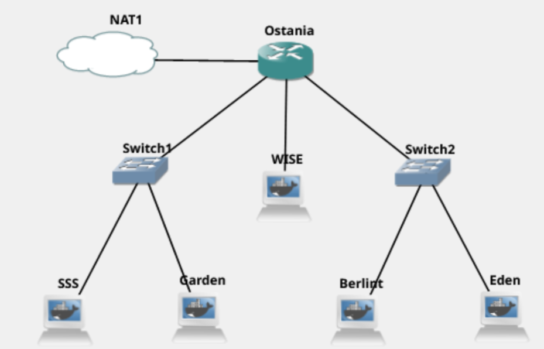
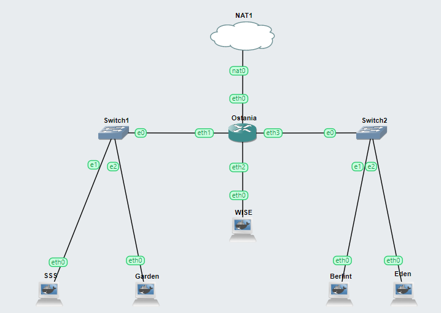
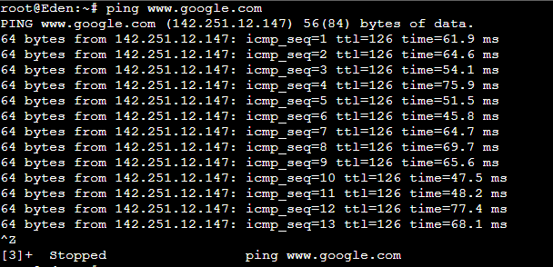
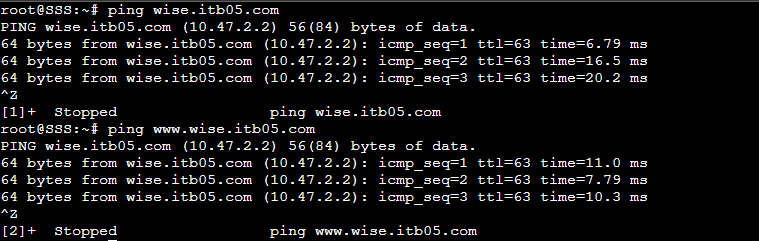
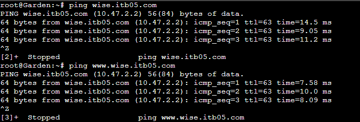

# Jarkom-Modul-2-ITB05-2022
Kelompok ITB05

1. M.Fernando N.Sibarani (5027201015)
2. Richard Nicolas (5027201021)
3. Muhammad Ihsanul Afkar (5027201024)


# Daftar Isi
* [Soal 1](#soal-1) 
* [Soal 2](#soal-2) 
* [Soal 3](#soal-3) 
* [Soal 4](#soal-4) 
* [Soal 5](#soal-5) 
* [Soal 6](#soal-6) 
* [Soal 7](#soal-7) 
* [Soal 8](#soal-8) 
* [Soal 9](#soal-9) 
* [Soal 10](#soal-10)
* [Soal 11](#soal-11)
* [Soal 12](#soal-12) 
* [Soal 13](#soal-13)
* [Soal 14](#soal-14) 
* [Soal 15](#soal-15) 
* [Soal 16](#soal-16) 
* [Soal 17](#soal-17) 
* [Kendala](#kendala)

# Soal-1
WISE akan dijadikan sebagai DNS Master, Berlint akan dijadikan DNS Slave, dan Eden akan digunakan sebagai Web Server. Terdapat 2 Client yaitu SSS, dan Garden. Semua node terhubung pada router Ostania, sehingga dapat mengakses internet 
 <br>
## Penyelesaian Soal 1
Berikut ini adalah topologi yang kami buat 
<br>
Network konfigurasi pada node Ostania adalah sebagai berikut
```
auto eth0
iface eth0 inet dhcp

auto eth1
iface eth1 inet static
	address 10.47.1.1
	netmask 255.255.255.0

auto eth2
iface eth2 inet static
	address 10.47.2.1
	netmask 255.255.255.0

auto eth3
iface eth3 inet static
	address 10.47.3.1
	netmask 255.255.255.0
```
Network konfigurasi pada node SSS adalah sebagai berikut
```
auto eth0
iface eth0 inet static
	address 10.47.1.2
	netmask 255.255.255.0
	gateway 10.47.1.1
```
Network konfigurasi pada node Garden adalah sebagai berikut
```
auto eth0
iface eth0 inet static
	address 10.47.1.3
	netmask 255.255.255.0
	gateway 10.47.1.1
```
Network konfigurasi pada node WISE adalah sebagai berikut
```
auto eth0
iface eth0 inet static
	address 10.47.2.2
	netmask 255.255.255.0
	gateway 10.47.2.1
```
Network konfigurasi pada node Berlin adalah sebagai berikut
```
auto eth0
iface eth0 inet static
	address 10.47.3.2
	netmask 255.255.255.0
	gateway 10.47.3.1
```
Network konfigurasi pada node Eden adalah sebagai berikut
```
auto eth0
iface eth0 inet static
	address 10.47.3.3
	netmask 255.255.255.0
	gateway 10.47.3.1
```
Pada node `Ostania` file`.bashrc` dimasukkan kode
```
iptables -t nat -A POSTROUTING -o eth0 -j MASQUERADE -s 10.47.0.0/16
```
Pada file`.bashrc` di semua node kecualo `Ostania`, ditambahkan kode berikut ini pada bagian bawah
```
...
echo nameserver 10.47.2.2 > /etc/resolv.conf
echo nameserver 10.47.3.2 >> /etc/resolv.conf
echo nameserver 192.168.122.1 >> /etc/resolv.conf
```
Setelah semua node di-*restart*, semua node dapat terkoneksi dengan internet, contohnya pada Eden dilakukan `ping www.google.com`
 <br>
Koneksi ke internet behasil dilakukan,

# Soal-2
Untuk mempermudah mendapatkan informasi mengenai misi dari Handler, bantulah Loid membuat website utama dengan akses **wise.yyy.com** dengan alias **www.wise.yyy.com** pada folder wise 
## Penyelesaian Soal 2
Jalankan `loadDNS.bash` dengan perintah `bash loadDNS.bash`, berikut ini adalah isi dari `loadDNS.bash`
```
apt-get update
apt-get install bind9 -y

mkdir /etc/bind/jarkom

cp etc/bind/named.conf.loacal /etc/bind/named.conf.loacal
cp etc/bind/named.conf.options /etc/bind/named.conf.options
cp etc/bind/jarkom/wise.itb05.com /etc/bind/jarkom/wise.itb05.com
cp etc/bind/jarkom/2.47.10.in-addr.arpa /etc/bind/jarkom/2.47.10.in-addr.arpa 
service bind9 restart

```
Isi dari `/etc/bind/jarkom/named.conf.local` adalah sebagai berikut 
```
zone "wise.itb05.com" {
    type master;
    notify yes;
    also-notify { 10.47.3.2; }; // IP Berlint
    allow-transfer { 10.47.3.2; }; // IP Berlint
    file "/etc/bindjarkom/wise.itb05.com";
};

zone "2.47.10.in-addr.arpa"{
    type master;
    file "/etc/bindjarkom/2.47.10.in-addr.arpa";
}
```
Isi dari `/etc/bind/jarkom/wise.itb05.com` adalah sebagai berikut 
```
;
; BIND data file for local loopback interface
;
STTL    604800
@       IN      SOA     wise.itb05.com  root.wise.itb05.com. (
                                  2      ;Serial
                             604800      ;Refresh
                              86400      ;Retry
                        	2419200      ;Expire
                             604800 )    ;Negative Cache TTL
;
@           IN      NS          wise.itb05.com.
@           IN      A           10.47.2.2
@           IN      AAAA        ::1
www         IN      CNAME       wise.itb05.com.
eden        IN      A           10.47.3.3
www.eden    IN      CNAME       eden.wise.itb05.com
nsl         IN      A           10.47.3.2
operation   IN      NS          nsl
```
Setelah selesai, *ping* **wise.itb05.com** dan **www.wise.itb05.com** di *SSS*
 <br>
*ping* **wise.itb05.com** dan **www.wise.itb05.com** di *Garden*

# Soal-3
Setelah itu ia juga ingin membuat subdomain **eden.wise.yyy.com** dengan alias **www.eden.wise.yyy.com** yang diatur DNS-nya di WISE dan mengarah ke Eden
## Penyelesaian Soal 3
# Soal-4
Buat juga reverse domain untuk domain utama
## Penyelesaian Soal 4
# Soal-5
Agar dapat tetap dihubungi jika server WISE bermasalah, buatlah juga Berlint sebagai DNS Slave untuk domain utama
## Penyelesaian Soal 5
# Soal-6
Karena banyak informasi dari Handler, buatlah subdomain yang khusus untuk operation yaitu **operation.wise.yyy.com** dengan alias **www.operation.wise.yyy.com** yang didelegasikan dari WISE ke Berlint dengan IP menuju ke Eden dalam folder operation
## Penyelesaian Soal 6
# Soal-7
Untuk informasi yang lebih spesifik mengenai Operation Strix, buatlah subdomain melalui Berlint dengan akses **strix.operation.wise.yyy.com** dengan alias **www.strix.operation.wise.yyy.com** yang mengarah ke Eden
## Penyelesaian Soal 7
# Soal-8
Setelah melakukan Network konfigurasi server, maka dilakukan Network konfigurasi Webserver. Pertama dengan webserver www.wise.yyy.com. Pertama, Loid membutuhkan webserver dengan DocumentRoot pada /var/www/wise.yyy.com
## Penyelesaian Soal 8
# Soal-9
Setelah itu, Loid juga membutuhkan agar url **www.wise.yyy.com/index.php/home** dapat menjadi menjadi **www.wise.yyy.com/home**
## Penyelesaian Soal 9
# Soal-10
Setelah itu, pada subdomain **www.eden.wise.yyy.com**, Loid membutuhkan penyimpanan aset yang memiliki DocumentRoot pada /var/www/eden.wise.yyy.com
## Penyelesaian Soal 10
# Soal-11
Akan tetapi, pada folder /public, Loid ingin hanya dapat melakukan directory listing saja
## Penyelesaian Soal 11
# Soal-12
Tidak hanya itu, Loid juga ingin menyiapkan error file 404.html pada folder /error untuk mengganti error kode pada apache
## Penyelesaian Soal 12
# Soal-13
Loid juga meminta Franky untuk dibuatkan Network konfigurasi virtual host. Virtual host ini bertujuan untuk dapat mengakses file asset **www.eden.wise.yyy.com/public/js** menjadi **www.eden.wise.yyy.com/js**
## Penyelesaian Soal 13
# Soal-14
Loid meminta agar **www.strix.operation.wise.yyy.com** hanya bisa diakses dengan port 15000 dan port 15500
## Penyelesaian Soal 14
# Soal-15
dengan autentikasi username Twilight dan password opStrix dan file di /var/www/strix.operation.wise.yyy
## Penyelesaian Soal 15
# Soal-16
dan setiap kali mengakses IP Eden akan dialihkan secara otomatis ke **www.wise.yyy.com**
## Penyelesaian Soal 16
# Soal-17
Karena website **www.eden.wise.yyy.com** semakin banyak pengunjung dan banyak modifikasi sehingga banyak gambar-gambar yang random, maka Loid ingin mengubah request gambar yang memiliki substring “eden” akan diarahkan menuju eden.png. Bantulah Agent Twilight dan Organisasi WISE menjaga perdamaian!
## Penyelesaian Soal 17

# Kendala